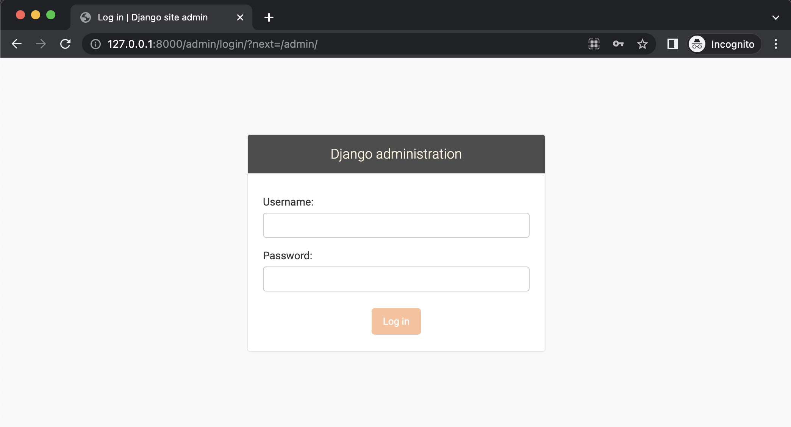

# Django 管理画面のカスタマイズサンプルソースコード

## 概要

Django は、Python で開発された人気のある Web フレームワークで、開発者が効率的に Web アプリケーションを構築できます。Django の管理画面は、データベースの管理や操作を容易にするための強力な機能を提供しています。このレポジトリでは、管理画面のカスタマイズを行ったソースコードを配布しています。

## 実行環境

- Python 3.10.3
- Django 4.1.7
- MacOS 13.2.1

## 実行手順

1. Python の仮想環境を構築

   ```
   % python3 -m venv venv
   ```

2. 仮想環境をアクティベート

   ```
    % source venv/bin/activate
   ```

3. 必要なライブラリのインストール

   ```
   (venv)% pip install -r requirements.txt
   ```

4. .env.example ファイルを.env にリネーム
5. SECRET_KEY を生成し、.env ファイルの SECRET_KEY に設定

   SECRET_KEY の作成方法

   ```
   (venv)% python manage.py shell
   >>> from django.core.management.utils import get_random_secret_key
   >>> get_random_secret_key()
   'xxx-xxxx' # この文字列を設定
   ```

6. マイグレート

   ```
   (venv)% python manage.py migrate
   ```

7. スーパーユーザーの作成

   ```
    (venv)% python manage.py createsuperuser
   ```

8. 開発用サーバーを起動

   ```
   (venv)% python manage.py runserver
   ```

9. ブラウザで、[http://127.0.0.1:8000/admin](http://127.0.0.1.8000/admin)にアクセス

   
